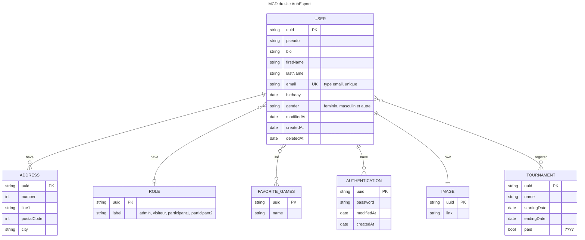

<!-- RELATIONSHIP
    |o	o|	Zero or one
    ||	||	Exactly one
    }o	o{	Zero or more (no upper limit)
    }|	|{	One or more (no upper limit) 

        CONTACT {
        int id
        string email "user or not ?"
        string name
        string message
        date date
    }
-->